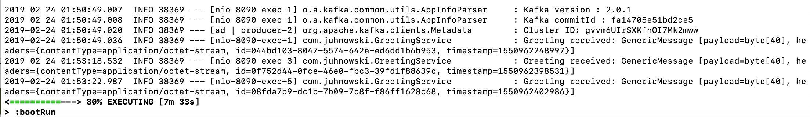
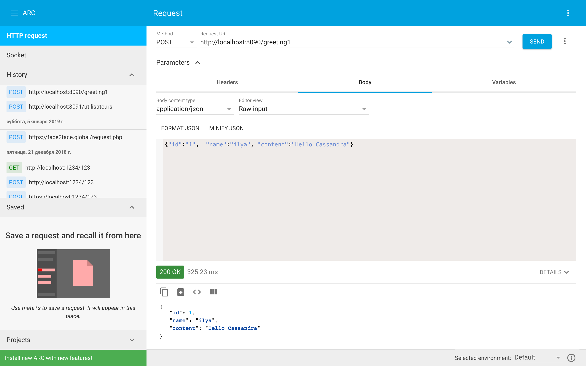
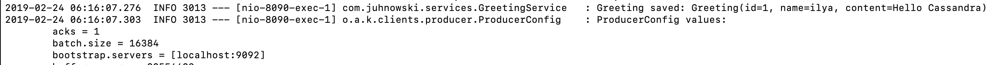
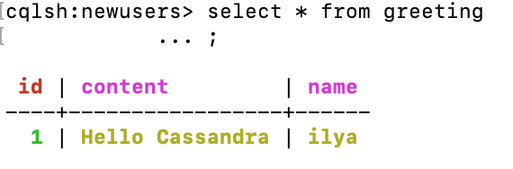

# Test Juhnowski Ilya

## Запуск сервис
./gradlew bootRun

## Запуск Kafka
docker run -p 2181:2181 -p 9092:9092 --env ADVERTISED_HOST=localhost --env ADVERTISED_PORT=9092 spotify/kafka

## Порт
Сменить порт сервиса можно в файле src/main/resources/application.properties

## Тест-1
URL: http://localhost:8090/greeting

## Тест-2
ARC или Postman
- Headers: Content-Type application/json
- URL: http://localhost:8090/greeting1
- Body: {"id":"1",  "content":"Hello Kafka"}

В консоле будет лог:

В ARC придет 200 ОК

## Построить из исходников
-  git clone https://github.com/juhnowski/grpc_spring_kotlin_kafka_cassandra_demo.git
- cd grpc_spring_kotlin_kafka_cassandra_demo/
- ./gradlew build
- ./gradlew bootJar
- docker build . -t grpc_spring_kotlin_kafka_cassandra_demo
- Если есть изменения: docker push juhnowski/grpc_spring_kotlin_kafka_cassandra_demo

## Docker
- docker -v
- docker stats
- docker pull juhnowski/grpc_spring_kotlin_kafka_cassandra_demo
- docker run -p 8090:8090 juhnowski/grpc_spring_kotlin_kafka_cassandra_demo:latest

## Cassandra - Docker
### Контейнер:
При использовании докер-контейнера надо изменить адрес кластера в файле application.properties

docker run --name demo-cassandra -d cassandra:latest

### Посмотреть логи:

docker logs demo-cassandra

### Консоль

docker run -it --link demo-cassandra:cassandra --rm cassandra sh -c 'exec cqlsh "$CASSANDRA_PORT_9042_TCP_ADDR"'

## Cassandra - local
Установить Cassandra локально и Java = 1.8:

- brew install 

To have launchd start cassandra now and restart at login:

- brew services start cassandra

Создать Keyspace 'newusers'

- cqlsh> CREATE KEYSPACE IF NOT EXISTS newusers WITH REPLICATION = { 'class' : 'NetworkTopologyStrategy', 'datacenter1' : 3 };

Создать таблицу:

create table greeting (id int PRIMARY KEY, name text, content text);

## Cassandra - Тест
В arc отправляем POST:

В консоли сервера видим:

В консоли Cassandra:

## gRPC
- ./gradlew installDist

- generate test proto: ./gradlew generateProto 